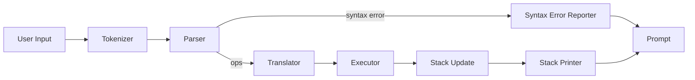

# AsmRpn - RPN Calculator in Assembly

This is a modular Reverse Polish Notation (RPN) calculator implemented in x86-64 assembly language using NASM syntax.

## Demo

[Demo](/Resources/Demo1.gif)

## Features

- REPL (Read-Eval-Print Loop) for interactive calculations
- Supports basic arithmetic operations: +, -, *, /
- Variable support with C-style naming (start with letter or _, contain letters, digits, _)
- Store operation using ' (e.g., 'var to store to variable)
- Forth-style stack words: `clear`, `drop`, `swap`
- String literal support with Pascal-style storage (quoted input, `+` concatenation)
- Modular architecture: tokenizer, parser, translator, executor
- CMake-based build system
- Automated tests
- Prints the stack after each operation

## Build

1. Ensure you have CMake and NASM installed.

2. Build the project:
   ```
   mkdir build
   cd build
   cmake ..
   make
   ```

3. Run the calculator:
   ```
   ../bin/rpn
   ```

4. Run tests:
   ```
   ctest
   ```
   Tests use input files in the `tests/` directory.

5. Enter RPN expressions, e.g.:
   ```
   λ 3 4 +
   [0] 7
   λ 5 2 -
   [0] 3
   λ 10 2 /
   [0] 5
   λ 42 'answer
   λ answer
   [0] 42
   λ 1 2 swap -
   [0] -1
   λ 1 2 clear 5
   [0] 5
   λ "hello"
   [0] "hello"
   λ "hi there" 'greeting greeting
   [0] "hi there"
   λ 1 +
   Stack underflow
   [0] 1
   ```

6. Press Ctrl+D to exit.

7. Colors are enabled automatically when stdout is a TTY and disabled when piping/redirecting. Use `--color` to force color or `--no-color` to force plain text.

## How it works

The calculator is structured in modules:

- **Tokenizer** (`tokenizer.asm`): Splits input into tokens
- **Parser** (`parser.asm`): Parses tokens into operations, enforcing syntax (operators such as `+` must be isolated tokens, so `4 +` is valid while `4+` becomes a syntax error)
- **Translator** (`translator.asm`): Translates operations to bytecode
- **Executor** (`executor.asm`): Executes bytecode on the stack and prints the stack after every execution cycle

- Numbers and variables are pushed onto the stack
- Operators pop operands, perform operations, and push results
- Variables use C-style names and are stored in a hash table
- The REPL reads input, tokenizes, parses, translates, executes, and prints the stack while reporting syntax/stack errors inline

### REPL pipeline



The diagram mirrors the implementation: each block is an assembly module and every arrow is an explicit call in `src/main.asm`.

## Stack display & error handling

- Stack indices now reflect the top of stack accurately (`[0]` is the topmost value, `[1]` is the next entry).
- Underflow is detected before arithmetic executes. When it happens the REPL prints a red `Stack underflow` message if color is enabled, then immediately re-prompts without crashing.
- Syntax errors abort a line before translation/execution. Examples: `4+` or `4++` now print `Syntax error: 4` and leave the previous stack untouched.
- Colors default to "auto" (TTY detection). Override with `--color` or `--no-color` on the CLI.

## Testing & reproducibility

Use the helper script plus piped sessions to exercise typical flows:

```bash
./r                    # rebuild + run banner smoke test
printf '3\n\n' | ./bin/rpn
printf -- '-3\n\n' | ./bin/rpn
printf '1 2\n\n+\n\n+\n' | ./bin/rpn
printf '+\n' | ./bin/rpn --color
```

These cover positive/negative literals, chained operations, syntax errors, and colored underflow handling.

## Limitations

- Only integer arithmetic
- No floating point support
- Stack size limited to 100 elements
- Simple parsing, no advanced error recovery
