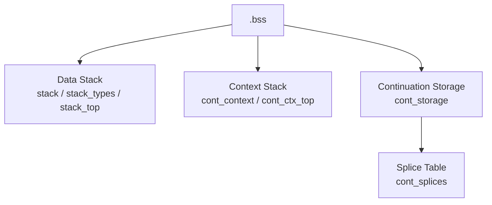
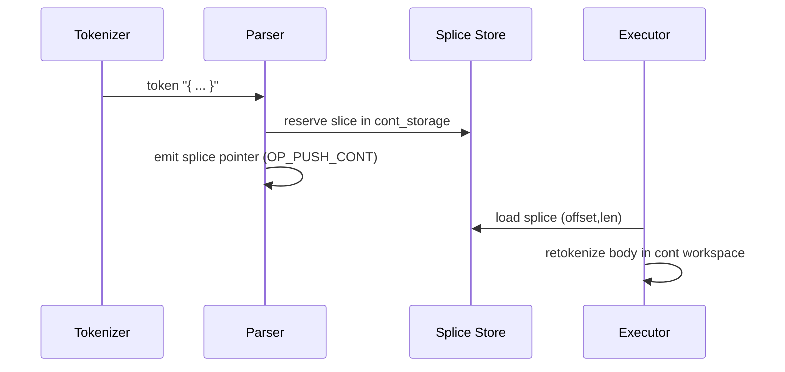
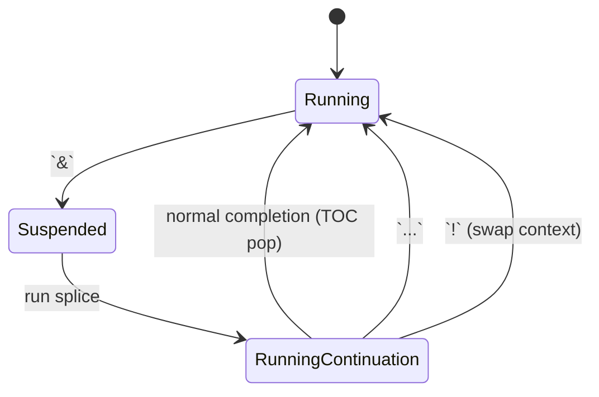
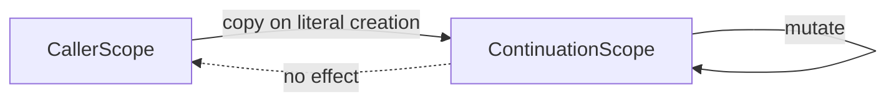
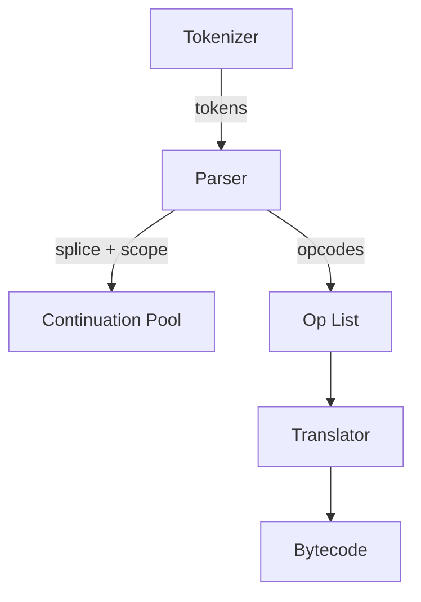
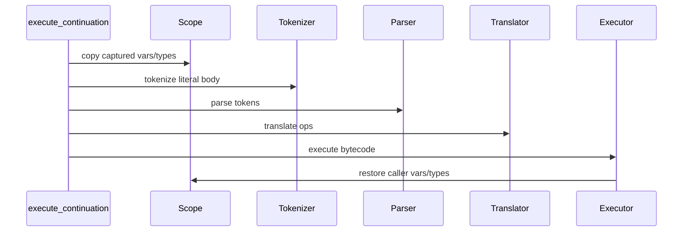
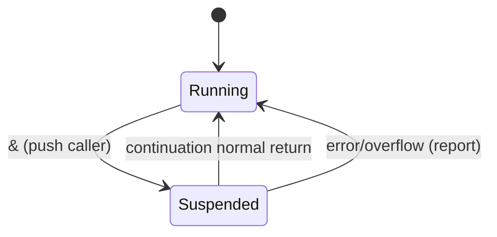
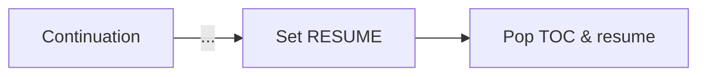
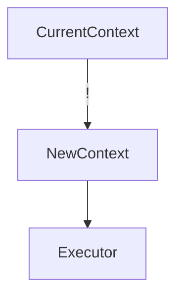

# Continuation Semantics

Continuations are the core control-flow abstraction of the REPL. They combine **splice-based literals** (to avoid copying), **private scopes** (to mimic lambdas), and **dual stacks** (context versus data) so execution can hop between suspended contexts cheaply.

## Memory Layout at a Glance

- **Data stack (TOD – Top Of Data)** holds operands for arithmetic and stack words. It is the existing `stack`, `stack_types`, and `stack_top` arrays.
- **Context stack (TOC – Top Of Context)** is a new array whose entries capture a suspended continuation: the instruction pointer (IP) into the bytecode stream plus the scope snapshot.
- **Continuation storage** is a shared byte buffer that stores every literal exactly once. Continuations reference it via *splices* (offset + length) rather than copying text.

## Continuation Literals and Splices

1. Tokenizer treats `{ ... }` as a single token.
2. Parser copies the literal text into `cont_storage` and records a splice `(offset, length)` in `cont_splices`.
3. The literal’s value on the data stack is a pointer to its splice descriptor. When executed, the splice is replayed into `cont_input_buffer` (without the braces) so it can be tokenized/parsed/translated in isolation.

This design avoids copying literal bodies every time they are executed and keeps scope snapshots small: only the variable table for the continuation’s scope is duplicated, not the literal text itself.

## Control Words and Stack Interactions

All control words manipulate the context stack while consuming continuations from the data stack. The following table summarizes the intent:

| Word | Effect | Context Stack Action | Data Stack Action |
|------|--------|----------------------|-------------------|
| `&`  | **Suspend** current program, run continuation | Push current (IP + scope) onto TOC before running the continuation. Automatically pop and resume when the continuation returns normally. | Pop continuation literal, run it in its own workspace. |
| `...` | **Resume** caller immediately | Pop TOC, discard the entry, resume the next context. Equivalent to “return”. | Data stack is left untouched; values remain as-is. |
| `!` | **Replace** current program with TOC | Pop TOC, discard current continuation, start executing the popped context without returning; enables mutual recursion/tail calls. | Leaves TOD intact so new context can consume it. |

### Suspension / Resume Flow

### Worked Examples

1. **Nested suspend/resume** — `{ 1 { 2 } & ... }`
   1. Outer literal pushes `1`.
   2. `&` pushes the outer context (IP + scope) onto TOC and runs `{ 2 }`.
   3. Inner literal pushes `2`; TOD is `[1, 2]`.
   4. `...` pops TOC and resumes the saved context, leaving `[1, 2]` and continuing after the `&`.

2. **Mutual recursion** — `{ 1 + b ! } 'a #  { 2 + a ! } 'b #`
   - Each literal names the other via variables. `!` replaces the running continuation with the one saved on TOC, so execution alternates forever.

3. **Lexical isolation** — `{ 1 'a #  a { a 1 + 'a # } }`
   - The inner continuation captures its own copy of `a`. Incrementing it does not affect the outer `a`, proving that scopes are snapshots, not references.

## Scope Rules in Detail

- Every continuation literal captures its scope by *copying* the relevant variable slots from `.bss`. Scopes are therefore immutable snapshots; stores (`'x #`) inside a continuation mutate only its private copy.
- The scope copy is part of the context entry pushed by `&`. When `...` or `!` swaps contexts, the correct scope snapshot is restored automatically.
- Because the data stack is shared globally, callers can stage operands for continuations before suspending. Continuations must explicitly `drop` or consume values if they should not leak back.

## Implementation Notes

- `.bss` allocations:
  - Data stack: `stack`, `stack_types`, `stack_top`.
  - Context stack: `cont_context`, `cont_ctx_top` (names TBD in the assembler but conceptually separate).
  - Splice storage: `cont_storage`, `cont_storage_offset`, `cont_splices`, `cont_splice_count`.
  - Continuation workspace: `cont_token_ptrs`, `cont_token_meta`, `cont_op_list`, `cont_bytecode`, `cont_input_buffer`.
- `execute_continuation` copies only the body between braces into `cont_input_buffer` before re-tokenizing and translating inside the continuation workspace, giving it a fresh scope.
- The parser maps `&`, `...`, and `!` to `OP_SUSPEND`, `OP_RESUME`, and `OP_REPLACE` respectively.

These building blocks keep continuation execution fast (thanks to splices) while maintaining the lexical guarantees expected from higher-level languages.
# Continuations & Dual Stack Plan

## Goals
1. Introduce a dual-stack runtime: data stack (operands) and context stack (continuations/frames).
2. Support continuation literals using `{ ... }` syntax.
3. Provide control-flow words (`resume`, `replace`, `suspend`, `>ctx`, `ctx>`).

## Phases
### Phase 1 – Dual Stacks
- Add context stack storage/helpers, show it in the REPL, and implement `>ctx` / `ctx>`.

### Phase 2 – Continuation Literals
- Tokenizer treats `{...}` as single tokens, parser emits `OP_PUSH_CONT`, executor can print/move them.

### Phase 3 – Control Flow
- Implement `resume`, `replace`, `suspend` by reusing tokenizer/parser/translator in a scratch workspace.
- `resume`: run continuation inline.
- `replace`: swap current execution with continuation.
- `suspend`: capture remaining ops as a continuation, push it, halt current run.

## Testing
- Tokenizer/parser unit tests for `{...}`.
- Executor tests for `resume`, `replace`, `suspend`, including type errors.
- Integration tests verifying context stack display and transfer words.
- Documentation updates describing syntax and new words.
# Continuations Implementation Plan

This plan breaks the continuation feature set into manageable phases. Each phase includes goals, dependencies, and validation points so we can reason about correctness before moving on. Mermaid diagrams illustrate how data and control flow evolve as we add features.

## Phase 1 – Literal/Scope Infrastructure

### Goals
1. Tokenizer remains a pure splitter; parser consumes brace tokens and constructs continuation literals.
2. Store literal bodies as *splices* in a shared buffer (`cont_build_buffer` → pool) and capture scope snapshots (`variables` + `var_types`).
3. Emit `OP_PUSH_CONT`, `OP_SUSPEND`, `OP_RESUME`, `OP_REPLACE` opcodes.
4. Extend runtime types with `TYPE_CONT`.

### Flow

### Analysis
- Parser must track brace depth to detect `{ ... }`. Errors surface early if braces mismatch.
- Scope snapshots ensure lexical isolation; establish memory footprint (VAR_SLOT_COUNT × literal count) to avoid overruns.
- Validation: define named continuations, display them on the stack without execution, confirm scope copies contain expected values.

## Phase 2 – Continuation Execution Workspace

### Goals
1. Introduce scratch token/op/bytecode buffers (`cont_token_ptrs`, etc.) and `active_*` indirection.
2. Implement `execute_continuation`: load splice, retokenize body, execute with captured scope.
3. Restore caller scope afterward.

### Flow

### Analysis
- Ensures continuations behave like lambdas: private scope, shared data stack.
- Handles empty literals gracefully.
- Tests: `{ 1 2 + }` produces `3`; storing/restoring `a` inside a continuation doesn’t leak outside.

## Phase 3 – Context Stack & `&`

### Goals
1. Allocate context stack (`context_ips`, `context_counts`, scope snapshots) with depth guard.
2. `context_push`/`context_pop_restore`/`context_pop_discard` helpers copy scopes and execution state.
3. Implement `OP_SUSPEND` (`&`):
   - Pop continuation from TOD.
   - Push current context.
   - Run continuation.
   - On normal completion, pop and resume caller.

### Flow

### Analysis
- `&` acts like call/cc: ensures nested suspends don’t corrupt state.
- Need overflow/underflow errors for TOC limits.
- Tests: `{ 1 { 2 } & + } -> 3`, nested `&` combinations, scope preservation after resume.

## Phase 4 – `...` (Resume)

### Goals
1. Add `continuation_signal` so continuations can request a jump back to caller mid-run.
2. `...` inside a continuation sets the signal, aborts current literal, and pops TOC to resume caller.
3. Ensure TOD contents from callee remain intact.

### Flow

### Analysis
- Behaves like `return`; must be illegal outside continuations.
- Tests: `{ a ... } 'b # { 1 2 + } 'a #` leaves `3` on TOD, TOC empty; error if `...` used at top level.

## Phase 5 – `!` (Replace)

### Goals
1. Tail-call semantics: pop continuation from TOD, replace current context, continue immediately.
2. No TOC growth; mutual recursion should not leak frames.

### Flow

### Analysis
- Validate `{ a ! } 'b # { b ! } 'a #` loops forever without context growth.
- Also confirm `{ 1 + } 'add # 2 add !` produces `3` and empty TOC.

## Phase 6 – Robustness & Regression Suite

### Goals
1. Build ~50 scripted tests (could be shell scripts feeding programs to `rpn`) covering:
   - Basic literals/scope isolation.
   - Nested `&`/`...`/`!` combinations.
   - Mutual recursion, early returns, stack underflows/overflows.
   - Error cases (invalid tokens, misuse of control words).
2. Document each canonical example in `docs/continuations_spec.md` and keep diagrams synced.

### Analysis
- Ensures future loop/conditional work rests on proven primitives.
- Provides safety net for context-stack regressions.

---

This phased plan keeps each layer testable before building the next. Once Phases 1–5 are solid, we’ll have the continuation foundation needed to implement loops/conditionals on top.
