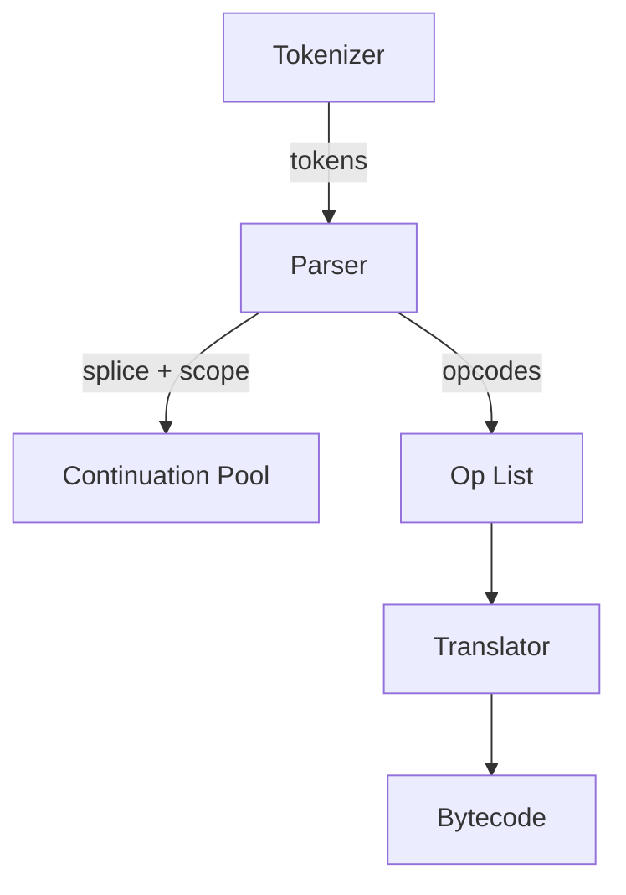
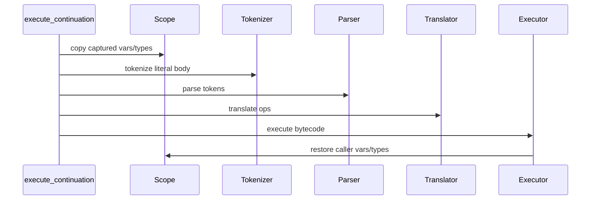
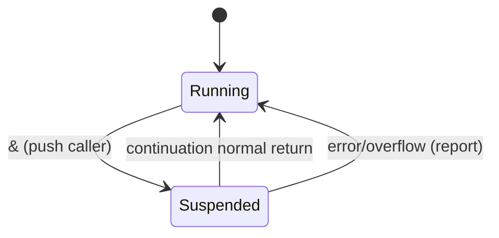
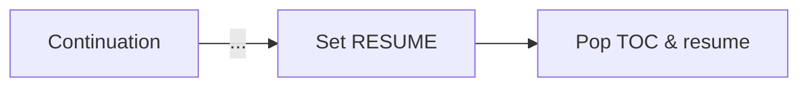
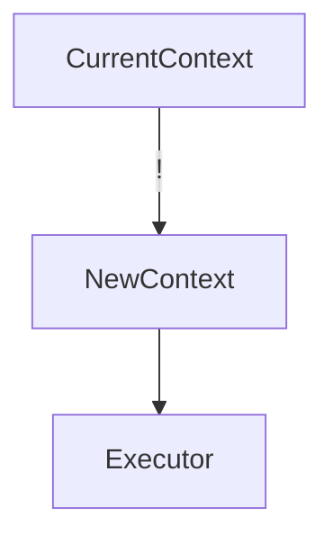

# Continuations Implementation Plan

This plan breaks the continuation feature set into manageable phases. Each phase includes goals, dependencies, and validation points so we can reason about correctness before moving on. Mermaid diagrams illustrate how data and control flow evolve as we add features.

## Phase 1 – Literal/Scope Infrastructure

### Goals
1. Tokenizer remains a pure splitter; parser consumes brace tokens and constructs continuation literals.
2. Store literal bodies as *splices* in a shared buffer (`cont_build_buffer` → pool) and capture scope snapshots (`variables` + `var_types`).
3. Emit `OP_PUSH_CONT`, `OP_SUSPEND`, `OP_RESUME`, `OP_REPLACE` opcodes.
4. Extend runtime types with `TYPE_CONT`.

### Flow

### Analysis
- Parser must track brace depth to detect `{ ... }`. Errors surface early if braces mismatch.
- Scope snapshots ensure lexical isolation; establish memory footprint (VAR_SLOT_COUNT × literal count) to avoid overruns.
- Validation: define named continuations, display them on the stack without execution, confirm scope copies contain expected values.

## Phase 2 – Continuation Execution Workspace

### Goals
1. Introduce scratch token/op/bytecode buffers (`cont_token_ptrs`, etc.) and `active_*` indirection.
2. Implement `execute_continuation`: load splice, retokenize body, execute with captured scope.
3. Restore caller scope afterward.

### Flow

### Analysis
- Ensures continuations behave like lambdas: private scope, shared data stack.
- Handles empty literals gracefully.
- Tests: `{ 1 2 + }` produces `3`; storing/restoring `a` inside a continuation doesn’t leak outside.

## Phase 3 – Context Stack & `&`

### Goals
1. Allocate context stack (`context_ips`, `context_counts`, scope snapshots) with depth guard.
2. `context_push`/`context_pop_restore`/`context_pop_discard` helpers copy scopes and execution state.
3. Implement `OP_SUSPEND` (`&`):
   - Pop continuation from TOD.
   - Push current context.
   - Run continuation.
   - On normal completion, pop and resume caller.

### Flow

### Analysis
- `&` acts like call/cc: ensures nested suspends don’t corrupt state.
- Need overflow/underflow errors for TOC limits.
- Tests: `{ 1 { 2 } & + } -> 3`, nested `&` combinations, scope preservation after resume.

## Phase 4 – `...` (Resume)

### Goals
1. Add `continuation_signal` so continuations can request a jump back to caller mid-run.
2. `...` inside a continuation sets the signal, aborts current literal, and pops TOC to resume caller.
3. Ensure TOD contents from callee remain intact.

### Flow

### Analysis
- Behaves like `return`; must be illegal outside continuations.
- Tests: `{ a ... } 'b # { 1 2 + } 'a #` leaves `3` on TOD, TOC empty; error if `...` used at top level.

## Phase 5 – `!` (Replace)

### Goals
1. Tail-call semantics: pop continuation from TOD, replace current context, continue immediately.
2. No TOC growth; mutual recursion should not leak frames.

### Flow

### Analysis
- Validate `{ a ! } 'b # { b ! } 'a #` loops forever without context growth.
- Also confirm `{ 1 + } 'add # 2 add !` produces `3` and empty TOC.

## Phase 6 – Robustness & Regression Suite

### Goals
1. Build ~50 scripted tests (could be shell scripts feeding programs to `rpn`) covering:
   - Basic literals/scope isolation.
   - Nested `&`/`...`/`!` combinations.
   - Mutual recursion, early returns, stack underflows/overflows.
   - Error cases (invalid tokens, misuse of control words).
2. Document each canonical example in `docs/continuations_spec.md` and keep diagrams synced.

### Analysis
- Ensures future loop/conditional work rests on proven primitives.
- Provides safety net for context-stack regressions.

---

This phased plan keeps each layer testable before building the next. Once Phases 1–5 are solid, we’ll have the continuation foundation needed to implement loops/conditionals on top.
