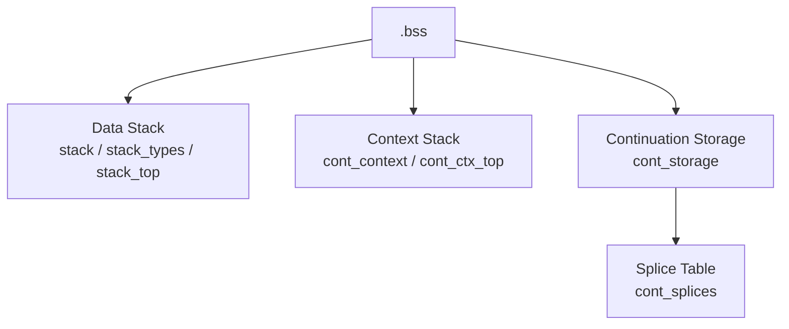
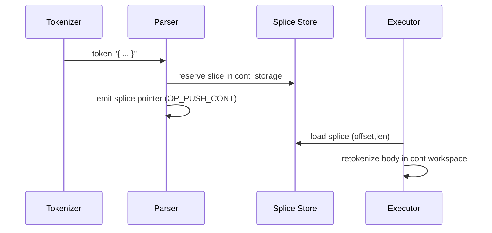
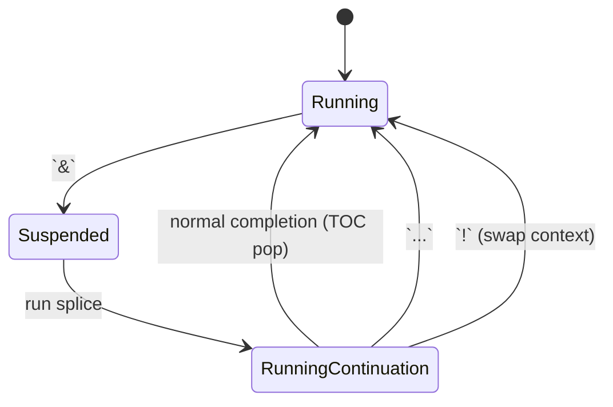
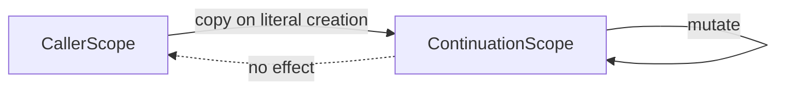

# Continuation Semantics

Continuations are the core control-flow abstraction of the REPL. They combine **splice-based literals** (to avoid copying), **private scopes** (to mimic lambdas), and **dual stacks** (context versus data) so execution can hop between suspended contexts cheaply.

## Memory Layout at a Glance

- **Data stack (TOD – Top Of Data)** holds operands for arithmetic and stack words. It is the existing `stack`, `stack_types`, and `stack_top` arrays.
- **Context stack (TOC – Top Of Context)** is a new array whose entries capture a suspended continuation: the instruction pointer (IP) into the bytecode stream plus the scope snapshot.
- **Continuation storage** is a shared byte buffer that stores every literal exactly once. Continuations reference it via *splices* (offset + length) rather than copying text.

## Continuation Literals and Splices

1. Tokenizer treats `{ ... }` as a single token.
2. Parser copies the literal text into `cont_storage` and records a splice `(offset, length)` in `cont_splices`.
3. The literal’s value on the data stack is a pointer to its splice descriptor. When executed, the splice is replayed into `cont_input_buffer` (without the braces) so it can be tokenized/parsed/translated in isolation.

This design avoids copying literal bodies every time they are executed and keeps scope snapshots small: only the variable table for the continuation’s scope is duplicated, not the literal text itself.

## Control Words and Stack Interactions

All control words manipulate the context stack while consuming continuations from the data stack. The following table summarizes the intent:

| Word | Effect | Context Stack Action | Data Stack Action |
|------|--------|----------------------|-------------------|
| `&`  | **Suspend** current program, run continuation | Push current (IP + scope) onto TOC before running the continuation. Automatically pop and resume when the continuation returns normally. | Pop continuation literal, run it in its own workspace. |
| `...` | **Resume** caller immediately | Pop TOC, discard the entry, resume the next context. Equivalent to “return”. | Data stack is left untouched; values remain as-is. |
| `!` | **Replace** current program with TOC | Pop TOC, discard current continuation, start executing the popped context without returning; enables mutual recursion/tail calls. | Leaves TOD intact so new context can consume it. |

### Suspension / Resume Flow

### Worked Examples

1. **Nested suspend/resume** — `{ 1 { 2 } & ... }`
   1. Outer literal pushes `1`.
   2. `&` pushes the outer context (IP + scope) onto TOC and runs `{ 2 }`.
   3. Inner literal pushes `2`; TOD is `[1, 2]`.
   4. `...` pops TOC and resumes the saved context, leaving `[1, 2]` and continuing after the `&`.

2. **Mutual recursion** — `{ 1 + b ! } 'a #  { 2 + a ! } 'b #`
   - Each literal names the other via variables. `!` replaces the running continuation with the one saved on TOC, so execution alternates forever.

3. **Lexical isolation** — `{ 1 'a #  a { a 1 + 'a # } }`
   - The inner continuation captures its own copy of `a`. Incrementing it does not affect the outer `a`, proving that scopes are snapshots, not references.

## Scope Rules in Detail

- Every continuation literal captures its scope by *copying* the relevant variable slots from `.bss`. Scopes are therefore immutable snapshots; stores (`'x #`) inside a continuation mutate only its private copy.
- The scope copy is part of the context entry pushed by `&`. When `...` or `!` swaps contexts, the correct scope snapshot is restored automatically.
- Because the data stack is shared globally, callers can stage operands for continuations before suspending. Continuations must explicitly `drop` or consume values if they should not leak back.

## Implementation Notes

- `.bss` allocations:
  - Data stack: `stack`, `stack_types`, `stack_top`.
  - Context stack: `cont_context`, `cont_ctx_top` (names TBD in the assembler but conceptually separate).
  - Splice storage: `cont_storage`, `cont_storage_offset`, `cont_splices`, `cont_splice_count`.
  - Continuation workspace: `cont_token_ptrs`, `cont_token_meta`, `cont_op_list`, `cont_bytecode`, `cont_input_buffer`.
- `execute_continuation` copies only the body between braces into `cont_input_buffer` before re-tokenizing and translating inside the continuation workspace, giving it a fresh scope.
- The parser maps `&`, `...`, and `!` to `OP_SUSPEND`, `OP_RESUME`, and `OP_REPLACE` respectively.

These building blocks keep continuation execution fast (thanks to splices) while maintaining the lexical guarantees expected from higher-level languages.
