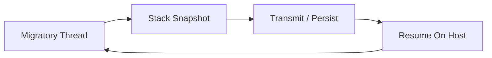

# THE DISTRIBUTED CONTINUUM: A BARE-METAL RUNTIME
**Volume I: Core Architecture & Kernel Interfaces**

**Author:** Christian Schladetsch
**Version:** 1.0.0 (Draft Specification)
**Target Architecture:** x86-64 (AMD64)
**Target Operating Systems:** Linux (ELF64), Windows (PE64)

---


## Runtime Addendum: Literal Semantics & Stack Display

The interactive RPN shell has grown a few creature comforts since the original draft:

* The stack printer now labels entries relative to the top of stack (`[0]` is the newest value, `[1]` is the next entry, etc.), which avoids the confusion that used to arise when indices counted from the bottom.
* Array literals such as `[1 2 3]` or `["hello" "world"]` are preserved as single tokens, stored verbatim, and printed without additional quoting so that nested structures can be inspected visually.
* Boolean conveniences (`true`, `false`) and an `assert` word ride alongside the arithmetic core so invariants can be checked inline without leaving the REPL.

These additions live entirely in the tokenizer/parser layers and do not change the underlying process-migration architecture described below.

# PREFACE: THE END OF THE REMOTE PROCEDURE CALL

The history of distributed computing is a history of trying to disguise the network. From CORBA in the 1990s to gRPC and Kubernetes in the 2020s, the industry has spent billions of dollars attempting to make a remote function call look like a local function call. We have built towers of abstraction—IDLs, stubs, skeletons, sidecars, and service meshes—all to sustain the illusion that code is static and data is mobile.

This model is fundamentally broken. It introduces an "Impedance Mismatch" between the local CPU and the distributed system. To bridge this gap, we serialize binary integers into ASCII JSON, transmit them over bloated HTTP headers, parse them back into binary, and execute a function that was sitting idle, waiting for input.

**The Continuum** proposes the inverse: **Literal Code Mobility**.

In this architecture, we do not send a request to a server asking it to do work. We send the *work itself*—in the form of a running process—to the server. The process arrives, executes, and potentially moves again. This eliminates the distinction between "client" and "server." Every node is simply a host for migratory threads of execution.

To achieve this, we must abandon the comforts of modern software development. We cannot use Managed Runtimes (Java, C#, Node) because they hide the machine state in complex, garbage-collected heaps. We cannot even use Systems Languages (C, C++, Rust) because they rely on the C Standard Library (`libc`), which initializes memory in opaque, platform-specific ways.

We must descend to the metal. We must write in **Pure Assembly**.

---

# CHAPTER 1: THE MEMORY MODEL

## 1.1 The "Stack-Only" Constraint

The fundamental technical challenge of Process Migration is **Serialization**. How do you take a running program and turn it into a byte stream?

In a traditional application, state is fractured across two domains:
1.  **The Stack:** A linear, contiguous LIFO structure containing local variables and control flow history.
2.  **The Heap:** A dynamic, non-contiguous graph structure containing allocated objects.

Serializing a Heap is an algorithmic nightmare. It requires:
* **Graph Traversal:** You must walk every object to find what it points to.
* **Cycle Detection:** You must handle objects that point to themselves.
* **Pointer Swizzling:** You must convert absolute memory addresses (e.g., `0x7FFF0040`) into relative IDs, because the memory address will be different on the destination machine.

### The $O(1)$ Serialization Strategy
The Continuum runtime solves this problem by strictly forbidding the use of the Heap for any state that must migrate. We adopt a **Stack-Only Paradigm**.

The Stack is strictly contiguous. It grows downwards from high memory to low memory. At any given instruction cycle, the entire state of the program is contained within the memory range `[RSP, StackBase]`.

Therefore, "Serialization" becomes a trivial memory copy operation:
`memcpy(NetworkBuffer, RSP, StackBase - RSP)`

This operation is $O(N)$ where $N$ is the depth of the stack, but architecturally it is $O(1)$ because it requires no structural analysis. We treat the stack as a raw binary blob.

## 1.2 Anatomy of a Bare-Metal Stack

While we treat the stack as a blob during transmission, the CPU treats it as a structured record of history. It contains two interleaved streams of data.

### 1.2.1 The Data Stream (Explicit State)
This consists of values explicitly pushed by the program.
```nasm
mov rax, 42
push rax        ; Pushes 8 bytes of 'Data'
sub rsp, 16     ; Allocates 16 bytes for local variables
```
These values represent the *business logic*. "The user's score is 42." "The loop counter is 5."

### 1.2.2 The Context Stream (Implicit State)
This consists of values pushed by the CPU to track execution flow.
```nasm
call _update_physics
```
When `call` executes, the CPU pushes the **Instruction Pointer (RIP)** of the *next* instruction onto the stack. This is the "Return Address."

**Crucially:** This Return Address is an **Absolute Virtual Address**. It is a 64-bit integer like `0x0000000000401055`.

## 1.3 The Relocation Paradox

This leads to the primary difficulty of bare-metal migration.

1.  **Node A** loads the executable code at `0x00400000`.
2.  **Node B** (running a modern OS with ASLR) loads the executable at `0x00550000`.
3.  We migrate a stack from Node A to Node B.
4.  The stack contains a return address pointing to `0x00401055`.
5.  On Node B, the memory at `0x00401055` is unmapped or garbage.
6.  The process executes `RET`, jumps to the invalid address, and crashes with a Segmentation Fault.

### The Solution: Fixed-Base Addressing
We cannot easily patch the stack because we cannot distinguish "Return Address Integers" from "Data Integers."

Therefore, we must enforce a **Universal Address Map**. We configure the Linker to hard-code the Virtual Base Address of the executable.
* **Linux:** `ld -Ttext=0x400000`
* **Windows:** `link /BASE:0x400000 /FIXED`

By disabling Address Space Layout Randomization (ASLR) and forcing a fixed base, we guarantee that `0x00401055` points to the exact same assembly instruction on every machine in the cluster.

---

# CHAPTER 2: THE WINDOWS "PURE MODE" ARCHITECTURE

Writing pure assembly for Linux is relatively straightforward because the System Call interface (`syscall` instruction) is stable and documented. Linux kernel version 5.x supports the same syscalls as 4.x.

Windows is different. The syscall numbers change with every update (Windows 10 v1903 has different numbers than v1909). The *only* stable interface is the high-level DLL API (`kernel32.dll`, `ntdll.dll`).

However, to maintain our "No External Dependencies" rule, we cannot link against `kernel32.lib`. If we did, our binary would rely on the Windows Loader to resolve imports.

We must implement our own **Dynamic Linker** in assembly.

## 2.1 The Thread Environment Block (TEB)
When a thread starts on x64 Windows, the `GS` segment register points to the **Thread Environment Block (TEB)**. This is our gateway to the kernel structures.

The TEB is a massive structure, but we only care about offset `0x60`, which contains the pointer to the **Process Environment Block (PEB)**.

```nasm
mov rax, qword [gs:0x60]  ; RAX now holds the address of the PEB
```

## 2.2 Walking the PEB
The PEB contains a struct called `PEB_LDR_DATA` at offset `0x18`. This struct contains the list of all DLLs loaded into the process memory.

```nasm
mov rax, [rax + 0x18]     ; RAX = PEB->Ldr
mov rax, [rax + 0x20]     ; RAX = Ldr->InMemoryOrderModuleList.Flink
```

This list is a doubly-linked list. Each node represents a loaded module.
1.  **Node 1:** The executable itself (our code).
2.  **Node 2:** `ntdll.dll` (The interface to the NT Kernel).
3.  **Node 3:** `kernel32.dll` (The Win32 API).

We traverse this list to finding the Base Address of `kernel32.dll`.

## 2.3 Parsing the PE Header
Once we have the base address of Kernel32, we must parse it to find functions like `LoadLibraryA` and `GetProcAddress`. This involves navigating the Portable Executable (PE) format manually.

1.  **DOS Header:** At offset 0. Read `e_lfanew` (offset `0x3C`) to find the NT Header.
2.  **NT Header:** Contains the "Optional Header."
3.  **Data Directories:** The last part of the Optional Header. Index 0 is the **Export Directory**.
4.  **Export Directory:** Contains three parallel arrays:
    * `AddressOfFunctions`: The code pointers.
    * `AddressOfNames`: The function name strings.
    * `AddressOfNameOrdinals`: The mapping between names and addresses.

## 2.4 Symbol Hashing (ROR-13)
We need to find "LoadLibraryA". Storing this string in our binary wastes bytes (13 bytes). Comparing strings is slow.

Instead, we use a hashing algorithm. **Rotate Right 13 (ROR-13)** is the standard for shellcode and minimal runtimes.

```nasm
; -----------------------------------------------------------------------
; FUNCTION: calc_hash_ror13
; INPUT: RSI = Pointer to ASCII string
; OUTPUT: R9D = 32-bit Hash
; -----------------------------------------------------------------------
calc_hash_ror13:
    xor r9d, r9d        ; Zero out hash accumulator
.loop:
    xor eax, eax
    lodsb               ; Load next byte from string
    test al, al         ; Check for null terminator
    jz .done            ; If zero, we are done
    
    ror r9d, 13         ; Rotate hash right by 13 bits
    add r9d, eax        ; Add the current character value
    jmp .loop
.done:
    ret
```

We pre-calculate the hash for `LoadLibraryA` (which is `0xEC0E4E8E`). We walk the Export Directory, hashing each name, until we find a match.

---

# CHAPTER 3: THE HARDWARE ABSTRACTION LAYER (HAL)

To allow the exact same business logic to compile for both Linux and Windows, we encapsulate the OS differences in a macro file named `platform.inc`.

## 3.1 The Virtual Opcode Philosophy
We define "Virtual Opcodes" that do not exist on the CPU but exist in our assembler logic.
* `OS_WRITE`: Writes to a file descriptor or handle.
* `OS_EXIT`: Terminates the process.
* `OS_SOCKET`: Creates a network endpoint.

## 3.2 Linux Implementation
Linux follows the System V AMD64 ABI. Arguments are passed in `RDI, RSI, RDX, R10, R8, R9`. The syscall number goes in `RAX`.

```nasm
; platform.inc (Linux)
%ifdef OS_LINUX
    %macro OS_WRITE 3
        mov rax, 1      ; sys_write
        mov rdi, %1     ; fd
        mov rsi, %2     ; buf
        mov rdx, %3     ; count
        syscall
    %endmacro
%endif
```

## 3.3 Windows Implementation
Windows follows the Microsoft x64 Calling Convention. Arguments are passed in `RCX, RDX, R8, R9`.
**Critical Constraint:** The caller is responsible for allocating 32 bytes of "Shadow Space" on the stack immediately before the `CALL`. This space is reserved for the callee to save the register arguments if needed.

Additionally, the Stack Pointer (`RSP`) must be 16-byte aligned at the moment of the `CALL`.

```nasm
; platform.inc (Windows)
%elifdef OS_WINDOWS
    %macro OS_WRITE 3
        push rbp
        mov rbp, rsp
        and rsp, -16      ; Force 16-byte alignment
        sub rsp, 32       ; Allocate Shadow Space
        
        mov rcx, %1       ; Handle
        mov rdx, %2       ; Buffer
        mov r8,  %3       ; Length
        xor r9, r9        ; Overlapped = NULL
        
        call [rel WriteFile_Ptr]
        
        mov rsp, rbp      ; Restore stack
        pop rbp
    %endmacro
%endif
```

---

# CHAPTER 4: THE CONTINUUM RUNTIME IMPLEMENTATION

This section details the specific assembly routines used to perform the migration.

## 4.1 The Entry Point (`_start`)
We do not use `main`. We use `_start` (Linux) or `start` (Windows).

### Initialization Phase
1.  **Stack Base Capture:** Upon entry, the very first thing we do is save the address of the bottom of the stack. This is crucial because when we migrate, we need to know how much stack to copy.
2.  **OS Detection:** If Windows, run the PEB Walk to resolve `WriteFile` and Winsock.

```nasm
section .bss
    stack_base resq 1

section .text
global _start

_start:
    ; Capture the top of the stack (which is actually the bottom/base)
    ; In a pure binary, RSP at entry points to argc/argv, which is the "top" 
    ; of the user stack frame.
    mov [rel stack_base], rsp
    
    ; Application Logic Begins
    call main_loop
```

## 4.2 The Migration Routine (`sys_migrate`)
This is the heart of the system.

```nasm
; -----------------------------------------------------------------------
; ROUTINE: sys_migrate
; DESCRIPTION: Freezes execution and transmits to remote node.
; -----------------------------------------------------------------------
sys_migrate:
    ; [STEP 1] CONTEXT PRESERVATION
    ; We push the FLAGS register first to save arithmetic state.
    pushfq
    
    ; We push all General Purpose Registers.
    ; This places the exact state of the CPU onto the stack.
    ; Since we send the stack later, these are automatically included.
    push rax
    push rbx
    push rcx
    push rdx
    push rsi
    push rdi
    push rbp
    push r8
    push r9
    push r10
    push r11
    push r12
    push r13
    push r14
    push r15

    ; [STEP 2] PAYLOAD SIZE CALCULATION
    ; PayloadSize = StackBase - CurrentRSP
    mov rsi, rsp                ; Source = Current Stack Pointer
    mov rax, [rel stack_base]   ; Load saved base
    sub rax, rsp                ; RAX = Bytes to copy
    
    ; [STEP 3] HEADER CONSTRUCTION
    ; We manually construct the 20-byte header on the stack or in a buffer.
    ; Magic (4) + Size (8) + ResumeRIP (8)
    
    ; CRITICAL: The ResumeRIP is NOT the current instruction.
    ; It is the address of 'resume_remote'.
    lea rdx, [rel resume_remote]
    
    ; [STEP 4] TRANSMISSION
    ; We assume RDI holds the connected socket FD.
    ; First, send the header.
    ; Second, send the stack body (Address: RSI, Length: RAX).
    OS_WRITE rdi, rsi, rax
    
    ; [STEP 5] LOCAL TERMINATION
    ; The process has migrated. The local copy is now a shell.
    OS_EXIT 0

; -----------------------------------------------------------------------
; LABEL: resume_remote
; DESCRIPTION: The entry point on the DESTINATION machine.
; -----------------------------------------------------------------------
resume_remote:
    ; When the destination machine restores the stack and jumps here,
    ; the stack pointer (RSP) is pointing at the saved R15.
    
    ; We reverse the push order.
    pop r15
    pop r14
    pop r13
    pop r12
    pop r11
    pop r10
    pop r9
    pop r8
    pop rbp
    pop rdi
    pop rsi
    pop rdx
    pop rcx
    pop rbx
    pop rax
    popfq
    
    ; The CPU state is now IDENTICAL to the moment before 'sys_migrate' was called.
    ; We return to the caller of sys_migrate.
    ret
```

## 4.3 The Receiver Routine (`sys_resume`)
This routine runs on the server (the destination).

```nasm
sys_resume:
    ; 1. Read Header (Magic, Size, ResumeRIP)
    ; ... (Network Read Logic) ...
    
    ; 2. Pivot the Stack
    ; We calculate where the new stack should live.
    ; NewRSP = StackBase - PayloadSize
    mov rbx, [rel stack_base]
    sub rbx, rcx                ; RCX holds Payload Size
    
    ; 3. Ingest Data
    ; We read the stack data from the network directly into memory at [RBX].
    ; OS_READ(socket, rbx, rcx)
    
    ; 4. The Atomic Switch
    ; This single instruction changes the entire reality of the process.
    mov rsp, rbx
    
    ; 5. The Jump
    ; We jump to the address specified in the header (RDX).
    jmp rdx
```

---

[End of Volume I]
