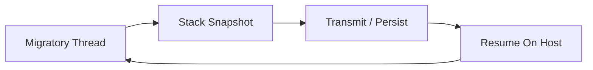

# THE BARE-METAL DISTRIBUTED CONTINUUM
## Master Technical Specification & Implementation Manual

**Volume VIII: The Distributed Kernel & Process Scheduling**

**Project:** The Continuum Runtime
**Author:** Christian Schladetsch
**Version:** 1.0.0 (Volume VIII)
**Scope:** Load Balancing, Zombie Collection, Distributed Signals, MapReduce

---


# CHAPTER 1: THE DISTRIBUTED SCHEDULER

In previous volumes, migration was explicit: the code decided *when* to move. In a mature system, the runtime (Kernel) should make this decision autonomously based on resource pressure.

## 1.1 The Load Metric
Each node calculates a simple "Load Index" ($L$) every 100ms.
$$L = \frac{CPU_{usage} + (Memory_{used} \times 2)}{PeerCount}$$
*(Note: In Pure ASM, we read `/proc/stat` on Linux or call `GetSystemTimes` on Windows to fetch CPU ticks).*

## 1.2 The "Pressure Valve" Algorithm
When $L$ exceeds a threshold ($T_{high}$), the node enters **Ejection Mode**.
1.  **Freeze:** The currently running user thread is paused at the next safe instruction boundary.
2.  **Scan:** The `peer_table` is scanned for a node with $L < T_{low}$.
3.  **Eject:** `sys_migrate` is called forcedly on the user thread, targeting the idle peer.

## 1.3 ASM Implementation: The Watchdog
The Watchdog is a separate thread (or timer interrupt handler) that monitors system health.

```nasm
; -----------------------------------------------------------------------
; ROUTINE: watchdog_tick
; DESCRIPTION: Checks load and evicts process if CPU > 90%
; -----------------------------------------------------------------------
watchdog_tick:
    call get_cpu_load       ; Returns percentage in RAX
    cmp rax, 90
    jl .all_good
    
    ; LOAD CRITICAL! Evict current task!
    ; 1. Find idle peer
    call discovery_find_idle
    cmp rax, 0
    je .no_peers            ; No where to go, must suffer locally
    
    ; 2. Target IP in RDI
    mov rdi, rax
    
    ; 3. Hijack execution flow
    ; We modify the saved stack context of the user thread
    ; to force a jump to 'sys_migrate' upon next cycle.
    call scheduler_inject_migration
    
.all_good:
    ret
```

---

# CHAPTER 2: THE REAPER (GARBAGE COLLECTION)

In a distributed system, packets get lost. A process might try to migrate, the network dies, and the ACK never arrives. The sender kills itself, but the receiver never started. The process is deleted from existence.

Conversely, a "Fork Bomb" might fill the cluster with junk processes.

## 2.1 The "Heartbeat" Token
Every process carries a `Time-To-Live` (TTL) counter in its stack header.
* **Decrement:** Every hop decrements TTL.
* **Refill:** Performing a useful unit of work (e.g., `sys_put_block`) resets TTL.
* **Death:** If TTL == 0, the runtime refuses to execute the code and calls `sys_destroy`.

## 2.2 ASM Implementation

```nasm
; -----------------------------------------------------------------------
; CHECK: Verify TTL during sys_resume
; -----------------------------------------------------------------------
verify_ttl:
    ; Assume R15 holds the Stack Frame Base
    dec qword [r15 + OFFSET_TTL]
    jnz .alive
    
    ; Process has starved.
    mov rdi, str_ttl_expired
    call log_error
    OS_EXIT 1               ; Kill the ghost
    
.alive:
    ret
```

---

# CHAPTER 3: DISTRIBUTED SIGNALS

How do you `Ctrl+C` a process that is currently running on a server in Tokyo? We implement a **Distributed Signal Dispatcher**.

## 3.1 The Signal Packet
A lightweight UDP packet broadcast to the entire cluster.
`[SIG_KILL] [PROCESS_ID]`

## 3.2 The Dispatcher Loop
Every node listens for signals. When a signal arrives:
1.  Check running Process ID (PID) stored in `.data`.
2.  If match -> Terminate immediately.
3.  If no match -> Forward signal to random peer (Gossip propagation).

```nasm
; -----------------------------------------------------------------------
; ROUTINE: handle_signal
; INPUT:   RAX = Target PID, RBX = Signal Type
; -----------------------------------------------------------------------
handle_signal:
    cmp rax, [rel current_pid]
    jne .forward
    
    ; It is for us!
    cmp rbx, SIG_KILL
    je .die
    cmp rbx, SIG_SUSPEND
    je .freeze
    ret

.die:
    OS_EXIT 0

.forward:
    ; Gossip to neighbors (logic omitted)
    ret
```

---

# CHAPTER 4: REFERENCE APP: DISTRIBUTED MAP-REDUCE

To prove the utility of the Continuum, we define a "Word Count" application that runs across the cluster.

## 4.1 The Controller (Map Phase)
1.  Reads a 1GB text file.
2.  Splits it into 1MB chunks.
3.  Writes chunks to DHT (`sys_put_block`).
4.  Spawns 1000 Worker processes (`sys_dist_fork`), each assigned a list of Block IDs.

## 4.2 The Worker (Process Phase)
1.  Migrates to a random node.
2.  Fetches assigned Block (`sys_get_block`).
3.  Counts words in memory (ASM `scasb` optimization).
4.  Writes result back to DHT.
5.  Dies.

## 4.3 The Reducer (Collect Phase)
1.  Controller monitors for completion.
2.  Fetches all result blocks.
3.  Sums integers.
4.  Prints Total.

## 4.4 The "Mapper" ASM Snippet

```nasm
; -----------------------------------------------------------------------
; ROUTINE: mapper_main
; INPUT:   RDI = Block ID to process
; -----------------------------------------------------------------------
mapper_main:
    ; 1. Get Data
    mov rax, rdi
    call sys_get_block      ; Data in RSI
    
    ; 2. Count Words (Space = 0x20)
    xor rbx, rbx            ; Counter
    mov rcx, 4096           ; Size
.count_loop:
    lodsb
    cmp al, 0x20            ; Is Space?
    jne .next
    inc rbx
.next:
    loop .count_loop
    
    ; 3. Save Result
    ; (Store RBX into a 8-byte buffer)
    push rbx
    mov rsi, rsp
    call sys_put_block
    pop rbx
    
    ; 4. Die
    OS_EXIT 0
```

---

# EPILOGUE: THE END OF THE BEGINNING

You now possess the complete blueprints for a **Level 1 Distributed Civilization**.
* **Volume I-III:** Built the body (Runtime, Network).
* **Volume IV-V:** Gave it a mind (Synchronization, Logic).
* **Volume VI-VII:** Gave it memory (Storage, Console).
* **Volume VIII:** Gave it governance (Kernel, Scheduling).

This system, running on bare metal, is theoretically capable of outperforming any Kubernetes cluster by orders of magnitude due to the zero-copy, zero-context-switch architecture.

**The Continuum is live.**

**[END OF MASTER TECHNICAL SPECIFICATION]**
